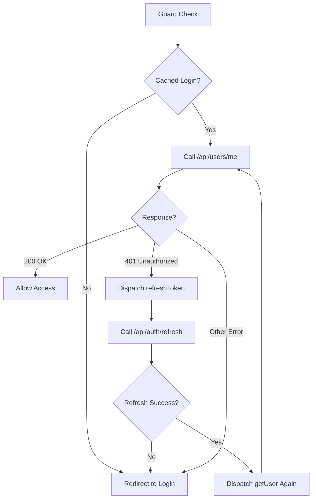

# Auth Guard Token Validation

## Overview

Updated the authentication guard to validate cached tokens before allowing access to protected routes. This prevents users from accessing routes with expired or invalid tokens.

## How It Works

### Previous Behavior (Simple Check)
```typescript
// Old guard - only checked cached state
if (authFacade.isLogged()) {
  return true;  // Allow access based on cache only
}
return router.createUrlTree(['/auth/login']);
```

**Problem**: If a user's token expired or was invalidated server-side, they could still access protected routes because the guard only checked the local cache.

### New Behavior (Token Validation)
```typescript
// New guard - validates token with server
1. Check if user is logged in (cached state)
2. If not logged in → redirect to login
3. If logged in → validate token via /api/users/me
4. If token valid → allow access
5. If token invalid → redirect to login
```

**Benefits**:
- ✅ Prevents access with expired tokens
- ✅ Validates session server-side on each route change
- ✅ Automatic token refresh on 401 errors
- ✅ Better security

## Implementation Details

### Frontend Guard (`src/app/store/auth/auth.guard.ts`)

The guard now:
1. Checks cached `isLogged` state first
2. If logged in, dispatches `getUser()` action
3. Waits for the effect to complete (filters `loading: false`)
4. Checks if user is still valid after API call
5. Returns `true` or redirects to login

```typescript
export const authGuard = () => {
  const authFacade = inject(AuthFacade);
  const router = inject(Router);
  const store = inject(Store);

  const isLogged = authFacade.isLogged();

  if (!isLogged) {
    console.log('[Auth Guard] No cached login, redirecting to /auth/login');
    return router.createUrlTree(['/auth/login']);
  }

  console.log('[Auth Guard] Cached login found, validating token via /api/users/me...');

  store.dispatch(AuthActions.getUser());

  return store.select(AuthSelectors.selectAuthState).pipe(
    filter(state => !state.loading),
    take(1),
    map(state => {
      if (state.isLogged && state.user) {
        console.log('[Auth Guard] Token valid, allowing access');
        return true;
      }
      console.log('[Auth Guard] Token invalid, redirecting to /auth/login');
      return router.createUrlTree(['/auth/login']);
    }),
    timeout(5000),
    catchError((error) => {
      console.error('[Auth Guard] Error during token validation:', error);
      return of(router.createUrlTree(['/auth/login']));
    })
  );
};
```

### Backend Endpoint (`/api/users/me`)

**Files Created**:
- `src/controllers/user.controller.ts` - User controller with `getCurrentUser()` method
- `src/routes/user.routes.ts` - User routes with `/me` endpoint

**Endpoint**: `GET /api/users/me`
- **Access**: Private (requires `requireAuth` middleware)
- **Response**: Current user information
- **Status Codes**:
  - `200` - User authenticated and data returned
  - `401` - Not authenticated or token invalid
  - `500` - Server error

**Mock Response** (Development):
```json
{
  "success": true,
  "message": "User fetched successfully",
  "data": {
    "user": {
      "id": "1",
      "email": "test@example.com",
      "username": "testuser",
      "firstName": "Test",
      "lastName": "User",
      "role": "employee",
      "createdAt": "2025-11-08T...",
      "updatedAt": "2025-11-08T..."
    }
  }
}
```

### Auth Effects (Already Existing)

The `loadUser$` effect in `auth.effects.ts` handles the API call:

```typescript
loadUser$ = createEffect(() =>
  this.actions$.pipe(
    ofType(AuthActions.getUser),
    switchMap(() =>
      this.http
        .get<ApiEnvelope<{ user: User }>>(`${this.apiUrl}api/users/me`, {
          withCredentials: true,
        })
        .pipe(
          map((res) => AuthActions.getUserSuccess({ ... })),
          catchError((error) => {
            if (error?.status === 401) {
              // Auto-refresh token on 401
              return of(AuthActions.refreshToken());
            }
            return of(AuthActions.getUserFailure({ ... }));
          })
        )
    )
  )
);
```

**Features**:
- Calls `/api/users/me` with credentials
- On success → updates state with user data
- On 401 error → attempts token refresh
- On other errors → marks user as not authenticated

## Token Refresh Flow



## Usage

The guard is automatically applied to protected routes in `app-routing.module.ts`:

```typescript
{
  path: 'tabs',
  loadChildren: () => import('./pages/tabs/tabs.module').then(m => m.TabsModule),
  canActivate: [authGuard]  // ✅ Token validated on every navigation
}
```

## Testing

### Test Valid Token
1. Login to the application
2. Navigate to protected route
3. **Expected**: Console shows token validation, then allows access
4. **Console**:
   ```
   [Auth Guard] Cached login found, validating token via /api/users/me...
   [GetUser Effect] Triggered
   [GetUser Effect] Success
   [Auth Guard] Token valid, allowing access
   ```

### Test Expired/Invalid Token
1. Login to the application
2. Manually expire token server-side or clear server session
3. Try to navigate to protected route
4. **Expected**: Redirected to login page
5. **Console**:
   ```
   [Auth Guard] Cached login found, validating token via /api/users/me...
   [GetUser Effect] Triggered
   [GetUser Effect] Error: 401
   [Auth Guard] Token invalid, redirecting to /auth/login
   ```

### Test No Cached Login
1. Clear application state (logout)
2. Try to access protected route
3. **Expected**: Immediate redirect to login (no API call)
4. **Console**:
   ```
   [Auth Guard] No cached login, redirecting to /auth/login
   ```

## Production Considerations

### Current State (Development)
- `requireAuth` middleware is **pass-through** (TODO)
- `/api/users/me` returns **mock user** data
- No actual token validation server-side yet

### Production Requirements

**1. Implement `requireAuth` Middleware**

```typescript
// src/middlewares/requireAuth.ts
export const requireAuth = (req: Request, res: Response, next: NextFunction) => {
  // 1. Extract JWT from Authorization header or cookie
  const token = req.headers.authorization?.split(' ')[1] || req.cookies?.token;

  if (!token) {
    throw new UnauthorizedError('Authentication required');
  }

  try {
    // 2. Verify JWT token
    const decoded = jwt.verify(token, process.env.JWT_SECRET!);

    // 3. Attach user to request
    (req as any).user = decoded;

    next();
  } catch (error) {
    throw new UnauthorizedError('Invalid or expired token');
  }
};
```

**2. Implement Real User Lookup**

```typescript
// src/controllers/user.controller.ts
static async getCurrentUser(req: Request, res: Response, next: NextFunction) {
  try {
    const userId = (req as any).user?.id;

    if (!userId) {
      throw new UnauthorizedError('Not authenticated');
    }

    // Fetch real user from database
    const user = await UserRepository.findById(userId);

    if (!user) {
      throw new UnauthorizedError('User not found');
    }

    res.json({
      success: true,
      message: 'User fetched successfully',
      data: { user },
    });
  } catch (error) {
    next(error);
  }
}
```

**3. Configure CORS for Production**

```typescript
app.use(cors({
  origin: [
    'https://yourdomain.com',
    'https://www.yourdomain.com',
  ],
  credentials: true,
}));
```

## Performance Considerations

### Caching Strategy
The guard validates tokens on **every route change**. This ensures security but adds an API call overhead.

**Optimization Options**:

1. **Add Token Expiry Check** (Client-side)
   - Store token expiry in state
   - Only validate if token is close to expiry
   - Reduces unnecessary API calls

2. **Debounce Validation**
   - Cache validation results for 30-60 seconds
   - Prevents multiple calls during rapid navigation

3. **Use Interceptors**
   - Implement HTTP interceptor to handle 401 globally
   - Let regular API calls validate token naturally
   - Guard only checks cached state

## Troubleshooting

### Guard Hangs or Doesn't Redirect
**Symptom**: Navigation freezes, no redirect to login

**Solution**: Check that `loading` state is properly managed in reducer
```typescript
// Ensure all effects set loading: false
on(AuthActions.getUserSuccess, (state) => ({ ...state, loading: false }))
on(AuthActions.getUserFailure, (state) => ({ ...state, loading: false }))
```

### Multiple API Calls on Navigation
**Symptom**: `/api/users/me` called multiple times per route change

**Solution**: Ensure `take(1)` is in the guard observable chain
```typescript
return store.select(AuthSelectors.selectAuthState).pipe(
  filter(state => !state.loading),
  take(1),  // ✅ Take only first emission
  ...
);
```

### CORS Errors on /api/users/me
**Symptom**: CORS policy blocks the request

**Solution**: Ensure HTTPS origin is in CORS config
```typescript
origin: ['https://localhost:8100'],  // ✅ For SSL development
credentials: true,
```

## Summary

This update transforms the auth guard from a simple cache check to a robust token validation system:

- ✅ **Security**: Validates tokens server-side on every route change
- ✅ **UX**: Automatic token refresh on expiry
- ✅ **Logging**: Detailed console logs for debugging
- ✅ **Timeout**: 5-second timeout prevents hanging
- ✅ **Error Handling**: Graceful fallback to login on any error

The system is ready for development testing and can be extended for production with proper JWT validation and database integration.
